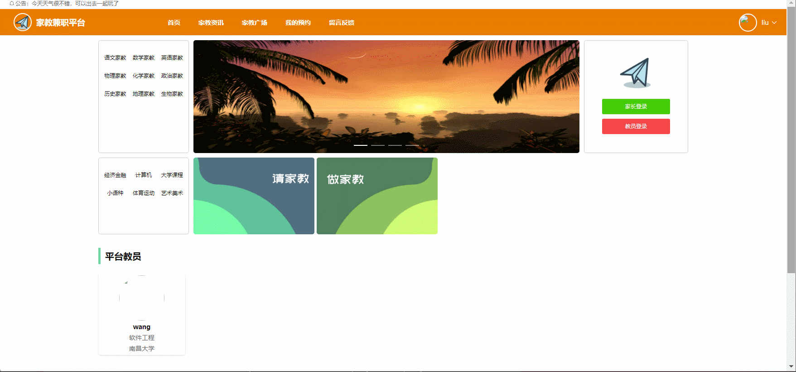
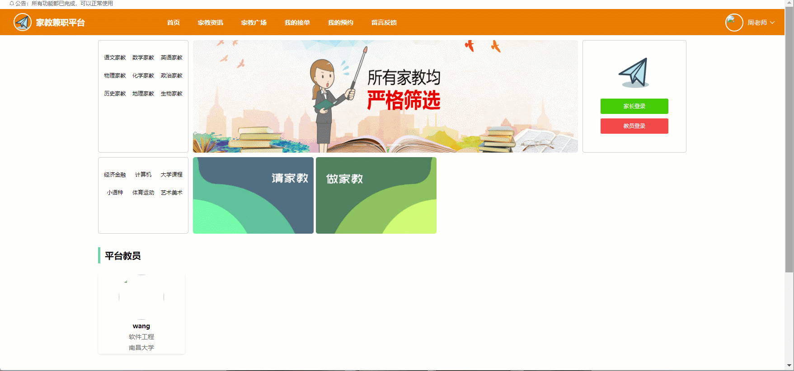

# tutor-service🎂

基于SpringBoot+Vue的家教平台

## 介绍🌞

> 后台系统包括系统首页、用户管理、信息管理、业务管理和个人中心等功能；教员角色包含的功能有登录、注册、首页、家教资讯、我的预约、留言反馈、我的发布等；家长角色应该具有资讯查看、查询教员、预约教员、发布家教、上传修 改资料等功能。


## 项目演示🌞

> 管理员


>家长



>教员



## 安装教程🌞

```
1. 运行环境准备mysql8 + java8 + node14.16.1 + redis

2. 配置maven路径，加载依赖

3. 运行sql文件，确保application.yml或config.properties的数据库名称和账号密码是数据库所在主机的账号密码
```


## 使用说明🌞

```
1. 登入

	管理员账号：admin 密码：123456

    家长账号：user 密码：123456

    教员账号：zhou 密码：123456
  
2. 运行流程

SpringBoot+Vue项目的部署详情可以查看这篇CSDN博客：http://t.csdnimg.cn/kpuxS

前后端不分离项目的部署流程可以查看这篇CSDN博客：http://t.csdnimg.cn/CslA5
```


## CSDN项目合集🌞

点击前往：http://t.csdnimg.cn/Q4u84


## 联系我🌞

**有偿获取完整源码或调试代码**

🐧：1902317191

微信：


